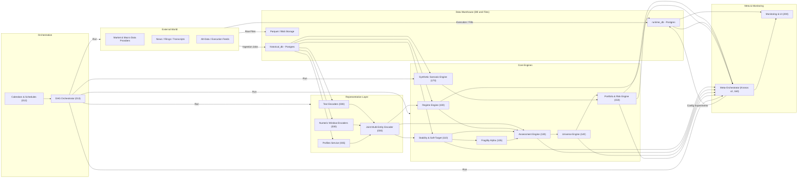

# Prometheus v2 – System Overview

High-level architecture and dataflow map for Prometheus v2.

## 1. Top-Level Dataflow

This diagram is a bird’s-eye view:
- **External**: data providers, news, execution.
- **Storage**: historical/runtime DBs plus file stores.
- **Encoders**: text/numeric/joint, and profile service.
- **Engines**: regime, stability & soft-target, fragility alpha, assessment, universe, portfolio & risk, synthetic scenarios.
- **Meta**: Kronos and monitoring/UI.
- **Orchestration**: calendars and DAG runner that triggers everything.

The more detailed engine-to-engine flows live in `20_engines.md`.