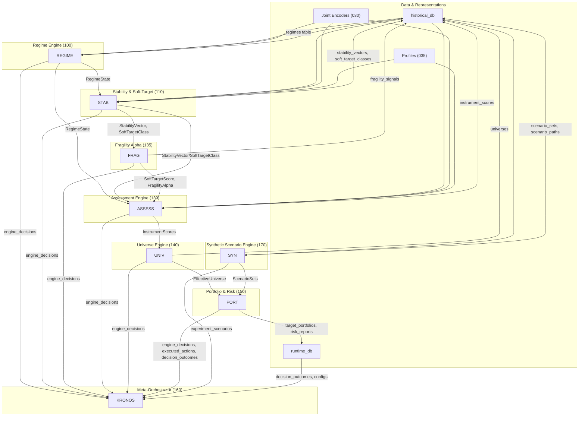

# Prometheus v2 – Engine Dataflows

This document zooms into how the core engines interact and what they read/write.

## 1. Engine Interaction Overview

## 2. Engine Roles (Summary)

- **Regime Engine (100)**
  - Reads: historical DB, joint embeddings.
  - Writes: `regimes` table.
  - Feeds: Stability, Assessment, Kronos.

- **Stability & Soft-Target Engine (110)**
  - Reads: historical DB, RegimeState, Profiles, joint embeddings.
  - Writes: `stability_vectors`, `fragility_measures`, `soft_target_classes`.
  - Feeds: Fragility Alpha, Assessment, Kronos.

- **Fragility Alpha (135)**
  - Reads: Stability outputs, Profiles, Black Swan scenarios (via Synthetic).
  - Writes: `fragility_signals` / `soft_target_scores`.
  - Feeds: Assessment, Kronos.

- **Assessment Engine (130)**
  - Reads: Regime, Stability, Fragility, Profiles, encoders, market/fundamental data.
  - Writes: `instrument_scores`.
  - Feeds: Universe, Portfolio, Kronos.

- **Universe Engine (140)**
  - Reads: Assessment scores, Stability/Profiles, risk/constraint config.
  - Writes: `universes`.
  - Feeds: Portfolio & Risk, Kronos.

- **Portfolio & Risk Engine (150)**
  - Reads: universes, instrument scores, risk models, scenarios, constraints.
  - Writes: `target_portfolios`, `portfolio_risk_reports`, execution orders.
  - Feeds: execution/external world, Kronos.

- **Synthetic Scenario Engine (170)**
  - Reads: historical returns, factor models, regimes, crisis templates.
  - Writes: `scenario_sets`, `scenario_paths`.
  - Feeds: Portfolio & Risk, Meta-Orchestrator, Stability/Fragility testing.

- **Meta-Orchestrator (160)**
  - Reads: decision logs (`engine_decisions`), executed actions, outcomes, configs, scenario risk.
  - Writes: config proposals, experiments, experiment results.
  - Feeds: humans (via UI), backtest schedulers, engines via updated configs.

These diagrams are intended to be your “wiring diagram” for engine interactions. The city-map you draw later can sit on top of this as a more visual metaphor.