# Prometheus v2 – Complete Database Schema

Entity-Relationship Diagram showing all tables with columns from `020_data_model.md` and `015_execution_and_backtesting.md`.

## 1. Complete Database Schema Overview

### 1.1 Table List with Column Counts

**Runtime DB (24 tables):**

**Core Entities:**
- `markets` (9 columns) - market_id, name, region, timezone, calendar_spec, metadata, created_at, updated_at
- `issuers` (9 columns) - issuer_id, issuer_type, name, country, sector, industry, metadata, created_at, updated_at  
- `instruments` (14 columns) - instrument_id, issuer_id, market_id, asset_class, symbol, exchange, currency, multiplier, maturity_date, underlying_instrument_id, status, metadata, created_at, updated_at
- `portfolios` (7 columns) - portfolio_id, name, description, base_currency, metadata, created_at, updated_at
- `strategies` (6 columns) - strategy_id, name, description, metadata, created_at, updated_at

**Profiles:**
- `profiles` (7 columns) - profile_id, issuer_id, as_of_date, structured, embedding_vector_ref, risk_flags, created_at

**Decision Logging:**
- `engine_decisions` (9 columns) - decision_id, timestamp, engine_name, config_id, context_id, as_of_date, input_refs, raw_input_summary, proposed_action
- `executed_actions` (9 columns) - action_id, decision_id, timestamp, portfolio_id, instrument_id, side, quantity, price, metadata
- `decision_outcomes` (8 columns) - decision_id, horizon_days, eval_date, pnl, return, drawdown, risk_metrics, label

**Configs & Models:**
- `engine_configs` (6 columns) - config_id, engine_name, version, config_body, created_at, created_by
- `models` (8 columns) - model_id, engine_name, type, artifact_ref, training_data_spec, metrics, created_at, created_by

**Execution:**
- `orders` (13 columns) - order_id, timestamp, instrument_id, side, order_type, quantity, limit_price, stop_price, status, mode, portfolio_id, decision_id, metadata
- `fills` (10 columns) - fill_id, order_id, timestamp, instrument_id, side, quantity, price, commission, mode, metadata
- `positions_snapshots` (10 columns) - snapshot_id, portfolio_id, timestamp, as_of_date, instrument_id, quantity, avg_cost, market_value, unrealized_pnl, mode

**Engine Outputs:**
- `regimes` (9 columns) - regime_record_id, as_of_date, region, regime_label, regime_embedding, embedding_ref, confidence, metadata, created_at
- `stability_vectors` (8 columns) - stability_id, entity_type, entity_id, as_of_date, vector_components, overall_score, metadata, created_at
- `fragility_measures` (7 columns) - fragility_id, entity_type, entity_id, as_of_date, fragility_score, scenario_losses, metadata, created_at
- `soft_target_classes` (11 columns) - soft_target_id, entity_type, entity_id, as_of_date, soft_target_class, soft_target_score, weak_profile, instability, high_fragility, complacent_pricing, metadata, created_at
- `instrument_scores` (12 columns) - score_id, strategy_id, market_id, instrument_id, as_of_date, horizon_days, expected_return, score, confidence, signal_label, alpha_components, metadata, created_at
- `universes` (8 columns) - universe_id, strategy_id, market_id, as_of_date, tier, instrument_ids, metadata, created_at
- `target_portfolios` (7 columns) - target_id, strategy_id, portfolio_id, as_of_date, target_positions, metadata, created_at
- `portfolio_risk_reports` (14 columns) - report_id, portfolio_id, as_of_date, portfolio_value, cash, net_exposure, gross_exposure, leverage, risk_metrics, scenario_pnl, exposures_by_sector, exposures_by_factor, metadata, created_at

**Scenarios:**
- `scenario_sets` (7 columns) - scenario_set_id, set_type, generated_date, generation_params, num_scenarios, metadata, created_at
- `scenario_paths` (8 columns) - path_id, scenario_set_id, scenario_index, instrument_id, start_date, end_date, returns_series, metadata

**Historical DB (13 tables):**

**Market Data:**
- `prices_daily` (10 columns) - instrument_id, trade_date, open, high, low, close, adjusted_close, volume, currency, metadata
- `returns_daily` (6 columns) - instrument_id, trade_date, ret_1d, ret_5d, ret_21d, metadata
- `factors_daily` (4 columns) - factor_id, trade_date, value, metadata
- `instrument_factors_daily` (4 columns) - instrument_id, trade_date, factor_id, exposure
- `volatility_daily` (6 columns) - instrument_id, trade_date, vol_21d, vol_63d, metadata
- `correlation_panels` (6 columns) - panel_id, start_date, end_date, universe_spec, matrix_ref, created_at

**Text & Events:**
- `news_articles` (7 columns) - article_id, timestamp, source, language, headline, body, metadata
- `news_links` (3 columns) - article_id, issuer_id, instrument_id
- `filings` (6 columns) - filing_id, issuer_id, filing_type, filing_date, text_ref, metadata
- `earnings_calls` (5 columns) - call_id, issuer_id, call_date, transcript_ref, metadata
- `macro_events` (7 columns) - event_id, event_type, timestamp, country, description, text_ref, metadata

**Embeddings:**
- `text_embeddings` (7 columns) - embedding_id, source_type, source_id, model_id, vector, vector_ref, created_at
- `numeric_window_embeddings` (9 columns) - embedding_id, entity_type, entity_id, window_spec, as_of_date, model_id, vector, vector_ref, created_at
- `joint_embeddings` (8 columns) - joint_id, joint_type, as_of_date, entity_scope, model_id, vector, vector_ref, created_at

### 1.2 Simplified Entity-Relationship Diagram



## 2. Table Counts and Sizes

**Runtime DB:**
- Core entities: 5 tables (markets, issuers, instruments, portfolios, strategies)
- Profiles: 1 table
- Decision logging: 3 tables (engine_decisions, executed_actions, decision_outcomes)
- Configs: 2 tables (engine_configs, models)
- Execution: 3 tables (orders, fills, positions_snapshots)
- Engine outputs: 8 tables (regimes, stability_vectors, fragility_measures, soft_target_classes, instrument_scores, universes, target_portfolios, portfolio_risk_reports)
- Scenarios: 2 tables (scenario_sets, scenario_paths)
- **Total: 24 tables**

**Historical DB:**
- Market data: 5 tables (prices_daily, returns_daily, factors_daily, instrument_factors_daily, volatility_daily, correlation_panels)
- Text & events: 5 tables (news_articles, news_links, filings, earnings_calls, macro_events)
- Embeddings: 3 tables (text_embeddings, numeric_window_embeddings, joint_embeddings)
- **Total: 13 tables**

**Grand Total: 37 tables**

## 3. Key Indexes (Performance Critical)

```sql
-- instruments
CREATE INDEX idx_instruments_issuer ON instruments(issuer_id);
CREATE INDEX idx_instruments_market ON instruments(market_id);
CREATE INDEX idx_instruments_status ON instruments(status);

-- prices_daily, returns_daily (composite for range queries)
CREATE INDEX idx_prices_date ON prices_daily(date);
CREATE INDEX idx_returns_date ON returns_daily(date);

-- engine_decisions (context and date lookups)
CREATE INDEX idx_decisions_context ON engine_decisions(context_id);
CREATE INDEX idx_decisions_as_of ON engine_decisions(as_of_date);
CREATE INDEX idx_decisions_engine ON engine_decisions(engine_name);

-- orders and fills (time-series queries)
CREATE INDEX idx_orders_timestamp ON orders(timestamp);
CREATE INDEX idx_fills_timestamp ON fills(timestamp);
CREATE INDEX idx_orders_portfolio ON orders(portfolio_id);

-- instrument_scores (strategy lookups)
CREATE INDEX idx_scores_strategy_date ON instrument_scores(strategy_id, as_of_date);
```

## 4. Notes

- All `timestamptz` columns stored in UTC per 010 foundations.
- `jsonb` columns used for flexible metadata and configs.
- Foreign keys enforce referential integrity where logical.
- `mode` field in execution tables (LIVE/PAPER/BACKTEST) enables unified schema.
- Embedding vectors stored as `bytea` or references to external storage.
