# Prometheus v2 – MASTER ARCHITECTURE

Complete end-to-end architecture showing all components, dataflows, and integrations.

## The Complete System



## Key Data Flows

### 1. **Live Trading Flow** (LIVE mode)
```
Market Data → Ingestion → historical_db 
→ Encoders → Engines (Regime → Stability → Fragility → Assessment → Universe → Portfolio) 
→ Order Planner → LiveBroker → IBKR Gateway 
→ Fills → runtime_db 
→ Kronos (analyzes outcomes)
```

### 2. **Backtesting Flow** (BACKTEST mode)
```
Historical Data (time-gated by TimeMachine) 
→ Engines (as above) 
→ Order Planner → BacktestBroker → MarketSimulator 
→ Simulated Fills → backtest results 
→ Kronos (evaluates experiment)
```

### 3. **Paper Trading Flow** (PAPER mode)
```
Same as Live but: PaperBroker → IBKR Paper Account (port 4001)
```

### 4. **Decision Logging Flow**
```
Every Engine → logs decision to engine_decisions table 
→ Order execution → fills logged to fills table 
→ After horizon H → decision_outcomes computed 
→ Kronos analyzes: decision + outcome → performance slice by regime/config 
→ proposes config changes
```

### 5. **Orchestration Flow** (Daily Cycle Example: US_EQ)
```
TradingCalendar detects: US_EQ enters POST_CLOSE state 
→ DAG Orchestrator triggers:
  1. us_eq_ingest_T (prices, events)
  2. us_eq_features_T (returns, vol, embeddings)
  3. us_eq_profiles_T (profile updates)
  4. us_eq_engines_T (all engines run)
  5. us_eq_execution_T (orders sent to broker)
→ Next day PRE_OPEN: quality checks run
```

## Component Counts

**Python Packages:** ~15 major packages
- core, data, encoders, profiles, regime, stability, assessment, universe, portfolio, meta, synthetic, monitoring, execution, scripts

**Engines:** 7 core decision engines
- Regime (100), Stability (110), Fragility Alpha (135), Assessment (130), Universe (140), Portfolio & Risk (150), Synthetic Scenarios (170)

**Database Tables:** 37 tables total
- historical_db: 13 tables
- runtime_db: 24 tables

**Specs:** 23+ specification documents (000-210)

**External Integrations:**
- IBKR Gateway/TWS (live + paper)
- Market data providers
- News/text feeds
- Macro data sources

## Code Reuse from v1

**Reusable (with adaptation):**
- Core infra (config, logging, DB connections)
- Data ingestion clients
- Monitoring patterns
- Some execution/broker adapter code

**Reference-only (superseded):**
- All v1 engines (regime, stability, assessment, etc.)
- LLM integration patterns

## Critical Path Dependencies

**Before any engine runs:**
1. historical_db populated with prices, events, text
2. Encoders trained and producing embeddings
3. Profiles built for entities
4. TradingCalendar configured for all markets
5. DAG orchestration operational

**Engine dependency chain:**
```
Regime → Stability → Fragility → Assessment → Universe → Portfolio → Execution
```

**For Kronos to work:**
- All engines logging to engine_decisions
- Fills logging to fills table
- decision_outcomes computed after horizons
- Config versioning in engine_configs

## Modes of Operation

| Mode | Broker | Data Source | Use Case |
|------|--------|-------------|----------|
| LIVE | LiveBroker → IBKR live (7496) | Real-time feeds | Production trading |
| PAPER | PaperBroker → IBKR paper (4001) | Real-time feeds | Strategy dry-run |
| BACKTEST | BacktestBroker → MarketSimulator | historical_db (time-gated) | Strategy validation, Kronos experiments |

## Fail-Safe & Monitoring

**Pre-execution checks:**
- Data quality gates (QC tasks in DAGs)
- Engine decision validation
- Risk limit checks before order submission

**Live monitoring:**
- Real-time pipeline status (per market state)
- Alert system (high-severity for ingestion/execution failures)
- UI showing current regime, stability, portfolio risk

**Kronos oversight:**
- Performance tracking by regime, config, market
- Automatic detection of degraded configs
- Experiment proposals (human-approved before promotion)

## Scale Targets

**Phase 1 (Initial):**
- Universe: S&P 500 (~500 instruments)
- Markets: US_EQ primary, US_FUT secondary
- Horizon: EOD execution
- Infrastructure: Single beefy machine (32 cores, 128GB RAM, 1 GPU optional)

**Phase 2 (Expansion):**
- Universe: US + EU + JP equities (~2000 instruments)
- Markets: US_EQ, EU_EQ, JP_EQ, FX_GLOB
- Horizon: Intraday capability
- Infrastructure: Distributed (multi-node orchestration)

**Phase 3 (Full System):**
- Universe: Global multi-asset (equities, futures, FX, credit)
- Markets: All major regions
- Horizon: Real-time regime/stability monitors
- Infrastructure: Cloud + on-prem hybrid
